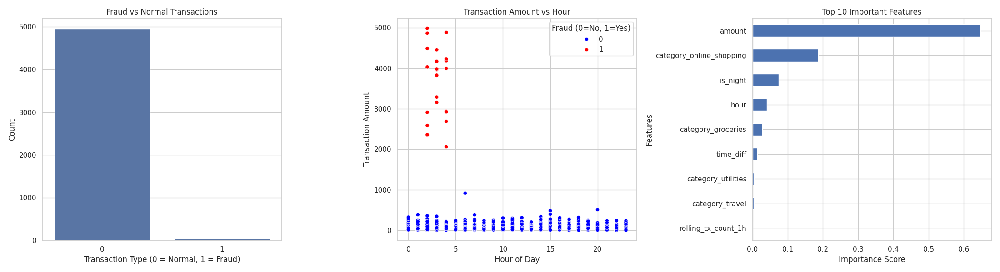
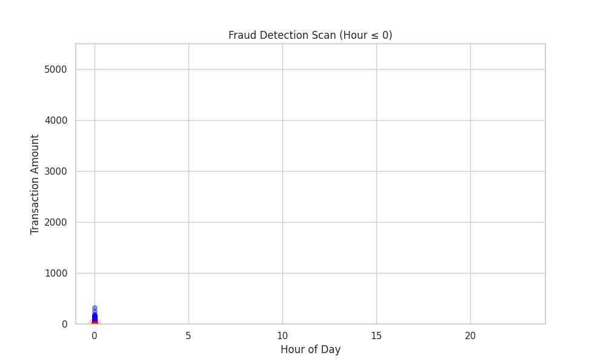
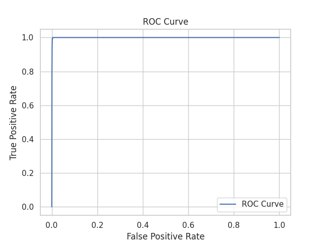
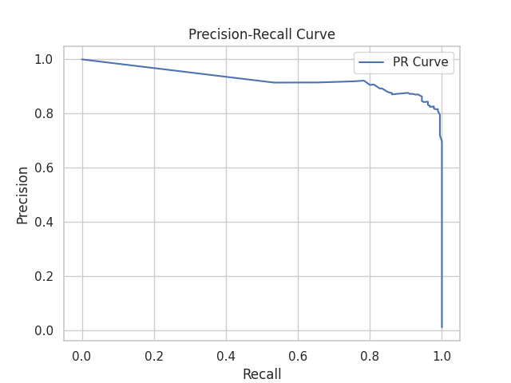

# fraud-detection-ml
mini project
# Fraud Detection System

## Overview

This project implements a machine learning-based fraud detection system using a generated synthetic transaction dataset and behavioral feature engineering. It includes a deployed Streamlit application for real-time predictions.

## Features

* Synthetic data generation with fraud simulation
* Feature engineering based on transaction behavior
* Class imbalance handling using SMOTE
* Random Forest classification model
* ROC and Precision-Recall evaluation
* Interactive Streamlit application

## Project Structure

* fraud_detection.py: Model training and pipeline
* app.py: Streamlit web app
* requirements.txt: Dependencies
* fraud_model.pkl: Saved trained model

## Outputs

### Dashboard

### Fraud Animation

### ROC Curve

### Precision-Recall Curve

## How to Run

Install dependencies:
pip install -r requirements.txt

Run app:
streamlit run app.py

## Future Improvements

* Real-world dataset integration
* Advanced model tuning
* Cloud deployment enhancements
